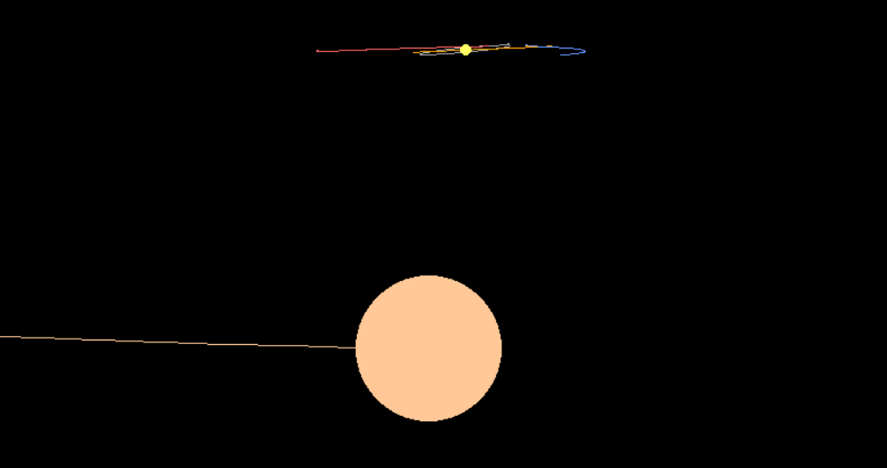
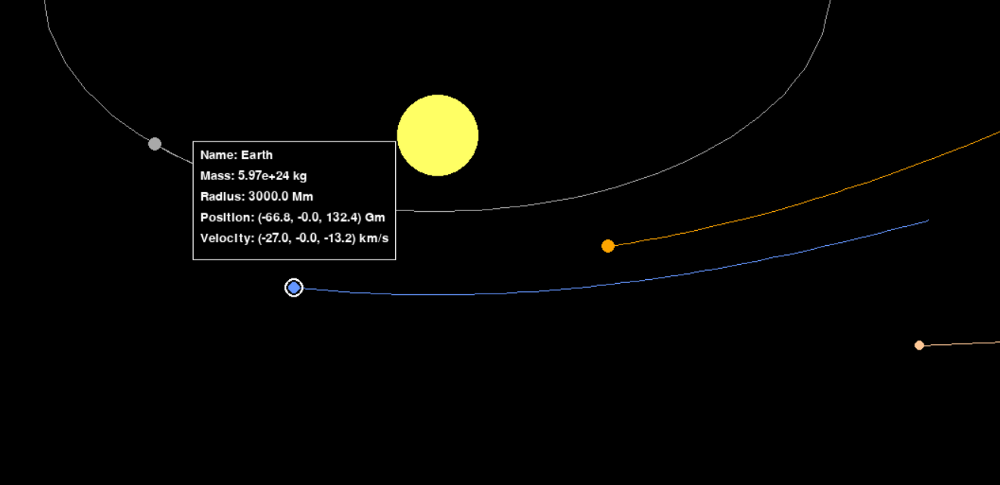
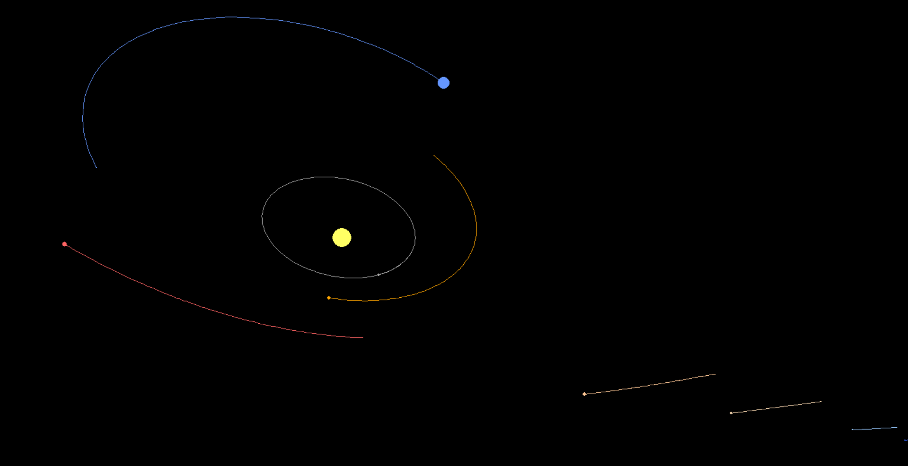
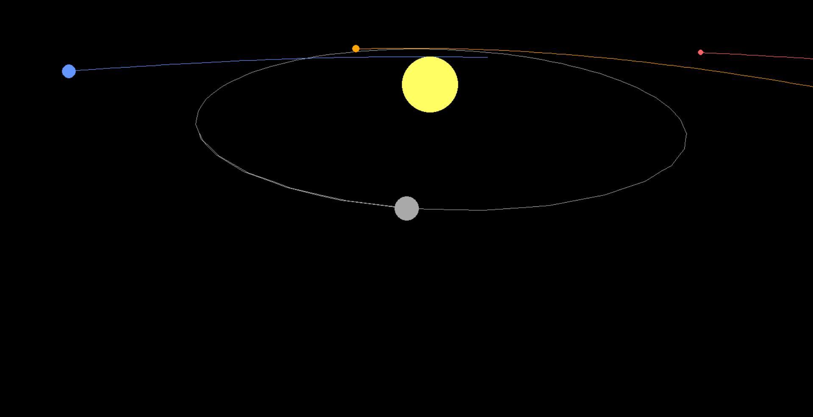
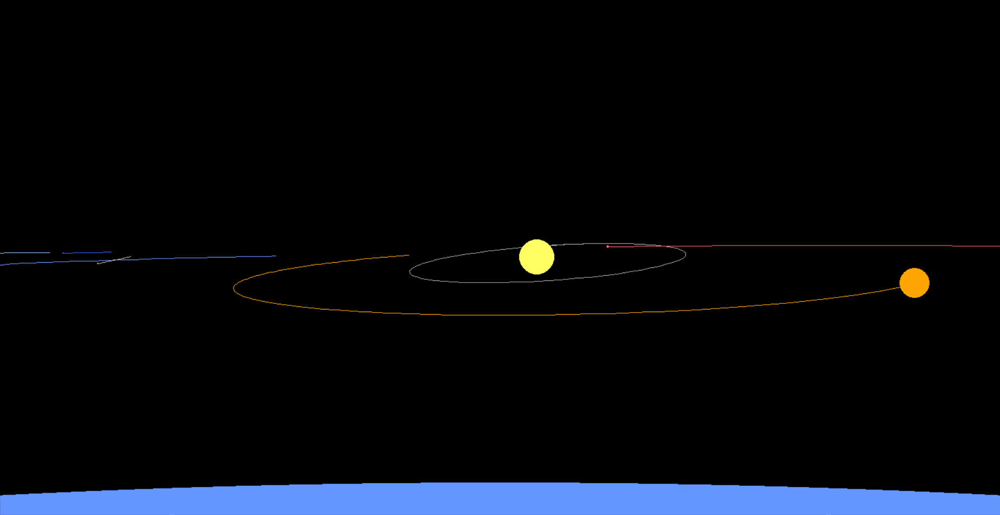
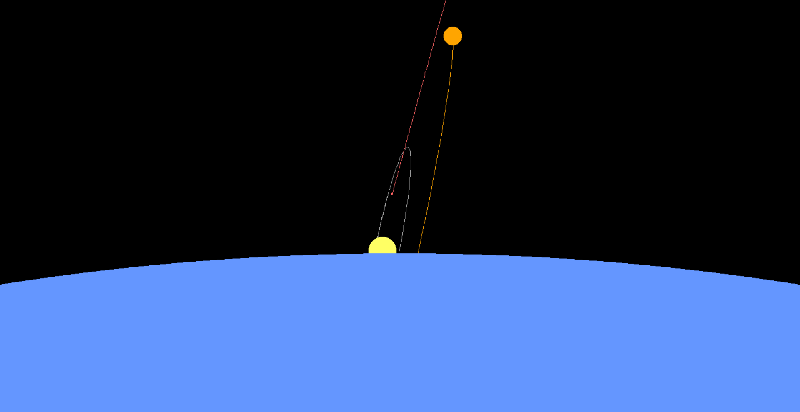
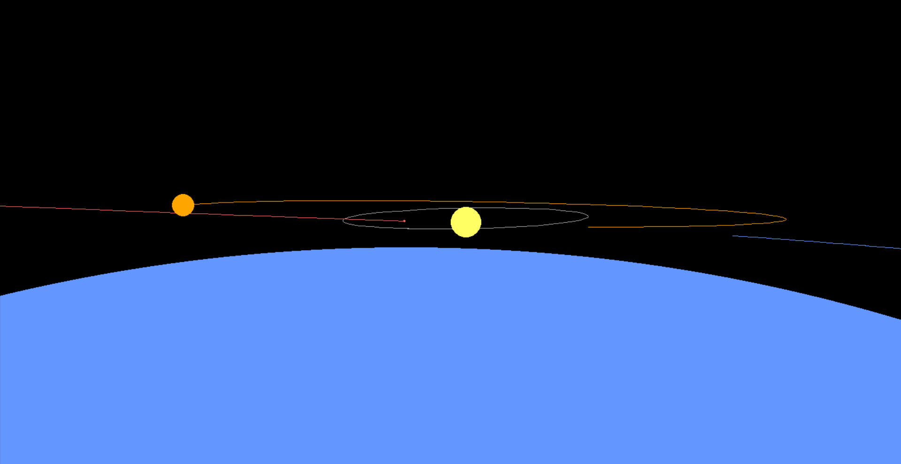
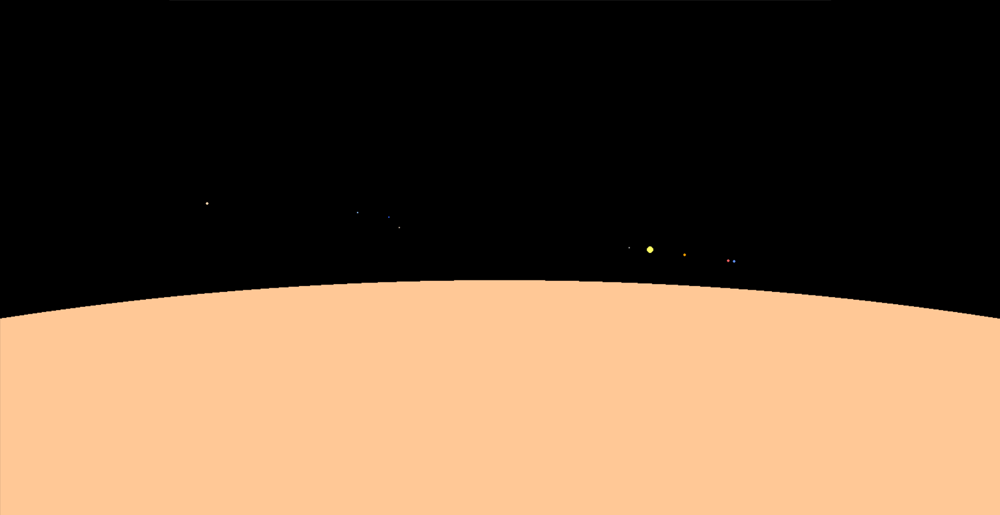
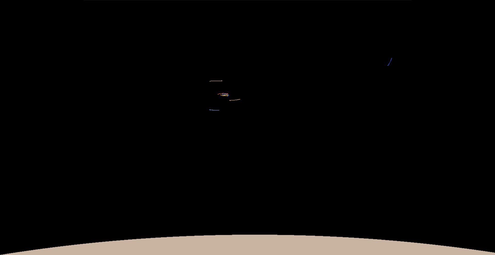

# 3D Gravity Simulation


*Closeup image of inner planets at slight angle with outer planets in background*

A realistic 3D solar system simulation with accurate gravitational physics, orbital mechanics, and free camera movement.

---

## Features

### **Realistic Solar System**

- **Complete planetary system** with all 8 planets + Pluto
- **Accurate orbital inclinations** - Mercury (7.0°), Venus (3.4°), Earth (0°), Mars (1.9°), Jupiter (1.3°), Saturn (2.5°), Uranus (0.8°), Neptune (1.8°), Pluto (17.2°)
- **Real astronomical data** - Actual masses, distances, and orbital velocities
- **Visibility-adjusted scale** - Bodies sized for visibility


*Pluto at the highest point of its inclined orbit - Can you find the missing planet?*

### **Advanced Physics Engine**

- **N-body gravitational simulation** - All bodies interact gravitationally
- **Accurate constants** - Real gravitational constant and time steps
- **Orbital mechanics** - Planets follow realistic elliptical orbits
- **Time manipulation** - Speed up or slow down simulation (0.01x to 100x)

### **Professional 3D Camera System**

- **Multiple camera modes** - Normal, Lock, and Planetary modes for different viewing experiences
- **5DOF movement** - Move in any direction (X,Y,Z) + rotate (pitch/yaw)
- **Proper perspective projection** - Realistic 3D to 2D screen projection
- **Depth-based rendering** - Proper occlusion of distant objects
- **Adjustable movement speed** - Control camera speed independently (0.1x to 10x)
- **Intuitive controls** - Global yaw + local pitch rotation
- **Resizable window** - Dynamic window sizing with centered view preservation


*Jupiter in Lock mode*

### **Visual Features**

- **Smooth orbital trails** - Distance-based trail generation with intermediate points
- **Time-independent trails** - Consistent trail length regardless of simulation speed
- **Gap-free rendering** - Trails connect smoothly to current positions
- **Depth-sorted rendering** - Proper 3D layering
- **Color-coded planets** - Realistic planetary colors
- **Interactive hover** - Mouse over planets shows detailed information
- **White halo effect** - Visual feedback for hovered bodies
- **Information panel** - Name, mass, radius, position, velocity display


*Image of Earth being hovered over, showing the information panel*

---

## Camera Modes

The simulation features three distinct camera modes, each optimized for different viewing experiences:

### **Normal Mode (Default)**

The standard free-roaming camera mode for exploring the solar system from any angle.


*The solar system from below in normal mode*

**Features:**

- **5DOF movement** - Full freedom of movement (X,Y,Z) + rotation (pitch/yaw)
- **Global coordinate system** - Movement relative to world axes
- **Stable and intuitive** - No restrictions or special behaviors
- **Perfect for exploration** - Navigate anywhere in space

**Controls:**

- **`Arrow Keys`** - Rotate camera (pitch/yaw)
- **`WASD`** - Move relative to camera view
- **`Q/E`** - Move forward/backward along camera view
- **`.` / `,`** - Adjust movement speed

### **Lock Mode**

Orbital tracking mode that locks the camera to a specific planet for detailed observation.


*Lock mode being locked on Mercury*

**Features:**

- **Automatic tracking** - Camera always points at locked planet
- **Orbital movement** - WASD moves you in orbital paths around the planet
- **Adjustable distance** - Q/E zooms in/out from locked planet
- **Perfect for observation** - Study planetary motion and details

**How to Activate:**

1. **Hover** over any planet to see its information panel
2. Press **`L`** to lock camera to that planet
3. Move mouse away from planet and press **`L`** to unlock and return to Normal mode

**Controls:**

- **`WASD`** - Orbital movement around locked planet
- **`Q/E`** - Zoom in/out from locked planet
- **Arrow keys are disabled** - Camera automatically tracks the planet

### **Planetary Mode**

Surface-level exploration mode that positions you on a planet's surface for immersive planetary exploration.



**Features:**

- **Surface-level positioning** - Camera positioned at planet's north pole
- **Immersive perspective** - Experience the motions of the planets from a planetary surface
- **Tangent-plane movement** - Movement stays on the planet's surface
- **Planetary coordinate system** - Movement relative to planet's surface

**How to Activate:**

1. **Hover** over any planet to see its information panel
2. Press **`P`** to enter Planetary mode on that planet
3. Move mouse away from planet and press **`P`** to exit to Normal mode

**Controls:**

**⚠️ Important Usage Warning:**
**Movement controls in Planetary mode are strongly discouraged** as they can cause camera rotation instability and disorientation. The planetary coordinate system is complex and movement may lead to unexpected camera behavior.

- **`Arrow Keys`** - Rotate camera view (pitch/yaw) ✅ **Safe**
- **`W/S`** - Move forward/backward along surface ⚠️ **Use sparingly**
- **`A/D`** - Strafe left/right along surface ⚠️ **May cause instability**

**Movement Guidelines:**

1. **Avoid excessive movement** - Movement controls can destabilize the camera
2. **Use W/S only when necessary** - Forward/backward movement is most stable
3. **For lateral movement** - Rotate (yaw) to face direction, then use W/S
4. **Reorient frequently** - Use the horizon to reestablish proper orientation
5. **Exit if disoriented** - Press `P` to return to Normal mode, camera is reoriented to normal system

**Examples of positions reachable with movement:**


*Image from the equator of Earth*


*Image from the south pole of Earth*

---

## Controls

### **Universal Controls**

These controls work in all camera modes:

- **`+` / `=`** - Speed up time (max 100x)
- **`-`** - Slow down time (min 0.01x)
- **`SPACE`** - Pause/Resume simulation
- **`R`** - Reset simulation to initial state
- **`T`** - Toggle orbital trails on/off
- **`C`** - Toggle UI on/off
- **`ENTER`** - Save current system state to file
- **`.` / `,`** - Adjust camera movement (and rotation) speed (0.1x to 10x)
- **`Mouse hover`** - Over planets to see detailed information
- **`ESC`** - Exit simulation

### **Mode Controls**

**Mode Activation:**

- **`L`** - Lock camera to hovered planet (Lock mode), move away and press `L` to unlock
- **`P`** - Enter Planetary mode on hovered planet (Planetary mode), move away and press `P`to exit

**Normal Mode Controls:**

- **`Arrow Keys`** - Rotate camera view (pitch/yaw)
- **`WASD`** - Move camera relative to view direction
- **`Q/E`** - Move forward/backward along camera view

**Lock Mode Controls:**

- **`WASD`** - Orbital movement around locked planet
- **`Q/E`** - Zoom in/out from locked planet
- **`Arrow Keys`** - Disabled (camera auto-tracks planet)

**Planetary Mode Controls:**

- **`Arrow Keys`** - Rotate camera view (pitch/yaw)
- **`W/S`** - Move forward/backward along surface
- **`A/D`** - Strafe left/right along surface

### **Display Information**

The UI shows current:

- **Time multiplier** - Simulation speed (0.01x to 100x)
- **Movement speed** - Camera movement multiplier (0.1x to 10x)
- **Camera position** - Current coordinates in space
- **Camera rotation** - Current yaw/pitch angles
- **Active mode** - Normal, Lock, or Planetary mode indicator


*Sun, Earth, Venus and Mars with active UI*

---

## Visuals

### **Visual Expectations**


*Top-down zoomed out image of the whole solar system*

The simulation displays a beautiful, scientifically accurate representation of our solar system with:

- **Dominant yellow Sun** at the center with realistic gravitational influence
- **Inner planets** (Mercury, Venus, Earth, Mars) with moderate orbital speeds
- **Gas giants** (Jupiter, Saturn) with impressive size and slower orbits
- **Ice giants** (Uranus, Neptune) with distinctive blue-green coloring
- **Highly inclined Pluto** orbiting above/below the main planetary plane
- **Smooth orbital trails** showing the paths each planet takes through space

### **3D Perspective Effects**


*Closeup image of Venus partialy occluding the sun, with Mercury and Earth visible*

- **Distance-based sizing** - Objects appear smaller when farther away
- **Proper occlusion** - Distant objects correctly hidden behind nearer ones
- **Realistic depth** - Full 3D spatial relationships maintained
- **Smooth camera movement** - Navigate freely through 3D space

### **Orbital Mechanics**


*Earth passing by Mars*

- **Elliptical orbits** - Planets follow Kepler's laws naturally
- **Gravitational interactions** - All bodies affect each other realistically
- **Conservation laws** - Energy and momentum properly conserved
- **Time dilation** - Speed up to see years pass in seconds

### **Planetary Mode Visuals**


*The solar system from Jupiter's surface, with trails disabled*

Experience the solar system from a planetary surface perspective with unique visual features:

- **Surface-level viewpoint** - See other planets from within the solar system
- **Planetary horizon** - Natural horizon line and atmospheric perspective
- **Relative planetary motion** - Watch other planets move across the sky
- **Surface-to-surface views** - Observe planets from different planetary locations
- **Dynamic celestial sphere** - See how planets appear from different vantage points
- **Immersive scale** - Experience the true scale of planetary distances from surface level


*The solar system from Pluto's surface, at the most downwards-inclined point of its orbit*

---

## System Configurations

### **Loading Different Systems**

The simulation supports loading different celestial system configurations:

```bash
# Load default system (system.json)
python main.py

# Load specific system file
python main.py --system systems/inner_planets.json

# Load custom system
python main.py --system path/to/your_system.json
```

### **Available Example Systems**

**Complete Systems:**

- **`systems/default_solar_system.json`** - Full solar system with all planets
- **`systems/full_solar_system.json`** - Complete system with 24 bodies (planets + major moons + dwarf planets)
- **`systems/inner_planets.json`** - Sun + Mercury, Venus, Earth, Mars (stable orbits)
- **`systems/gas_giants.json`** - Sun + Jupiter, Saturn, Uranus, Neptune (wide spacing)

**Special Configurations:**

- **`systems/binary_star.json`** - Two stars with distant planets (improved stability)
- **`systems/trinary_star.json`** - Three-star system with wide orbits
- **`systems/earth_moon.json`** - Earth-Moon system for detailed observation
- **`systems/jupiter_moons.json`** - Jupiter with four Galilean moons (realistic distances)
- **`systems/asteroid_belt.json`** - Mars-Jupiter region with asteroids

### **Save Current System**

**Press `ENTER` anytime to save the current system state:**

- **Save interesting moments** - Planetary alignments, unique configurations
- **Create custom systems** - Modified positions and velocities
- **Share configurations** - Save and share JSON files with others
- **Experimental setups** - Save your gravitational scenarios

**Files are saved to `systems/` folder and can be loaded with `--system` flag.**

### **⚠️ Stability Warning**

**Example configurations may become unstable over time:**

- **Gravitational interactions** can cause orbital perturbations
- **Close encounters** may result in slingshot effects
- **Multi-body systems** are inherently chaotic
- **Long simulations** (or also short ones) may show bodies ejected or collisions

**For stable long-term viewing, consider:**

- **Short time periods** - Observe initial orbital patterns
- **Fewer bodies** - Simpler systems are more stable
- **Careful positioning** - Avoid close initial encounters
- **Save interesting states** - Press `ENTER` to preserve moments

---

## Getting Started

### **Prerequisites**

- Python 3.8+ recommended
- NumPy for mathematical operations
- Pygame for graphics and input

### **Installation**

```bash
# Clone the repository
git clone <repository-url>

# Navigate to project
cd 3d-gravity

# Install dependencies
pip install -r requirements.txt

# Run the simulation
python main.py
```

### **Quick Start**

1. Run `python main.py` from project root
2. Use `ESC` to exit anytime
3. Press `C` to toggle UI for clean viewing
4. Hover over planets to see detailed information
5. Press `L` while hovering to lock camera to planet
6. Experiment with time controls (`+/-`) to see orbital evolution
7. Navigate with `WASD + Q/E + Arrow keys` to explore the solar system
8. Resize window dynamically while maintaining centered view

---

## Technical Details

### **Implementation Details**

**Physics Engine:**

- **N-body gravitational simulation** - All bodies interact gravitationally
- **Real gravitational constant** - G = 6.67430e-11 m³/kg·s²
- **Configurable time step** - Default: 86400 seconds (1 day)
- **Variable distance scale** - Set per system configuration
- **60 FPS rendering** - Smooth animation with time-independent physics

**System Configuration:**

- **JSON-based loading** - Flexible system definitions
- **Command line support** - `--system` flag for custom files
- **Dynamic body properties** - Mass, position, velocity, radius, color
- **Orbital inclinations** - Configurable per body in degrees
- **Custom color schemes** - Hex, RGB, or named colors

**Camera System:**

- **Vector-based orientation** - Forward, up, right vectors
- **5DOF movement** - 3 translation + 2 rotation (no roll)
- **Multiple camera modes** - Normal, Lock, Planetary
- **Perspective projection** - 3D to 2D screen transformation
- **Depth-based rendering** - Proper occlusion and sorting

**Save/Load System:**

- **ENTER key saving** - Preserve current system state
- **Complete state capture** - Positions, velocities, properties
- **Human-readable JSON** - Editable and shareable
- **Error handling** - Graceful fallbacks and validation
