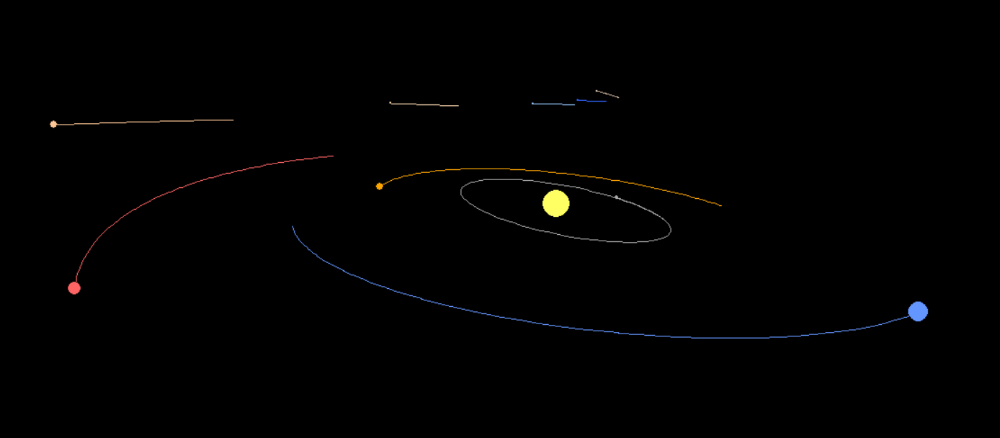
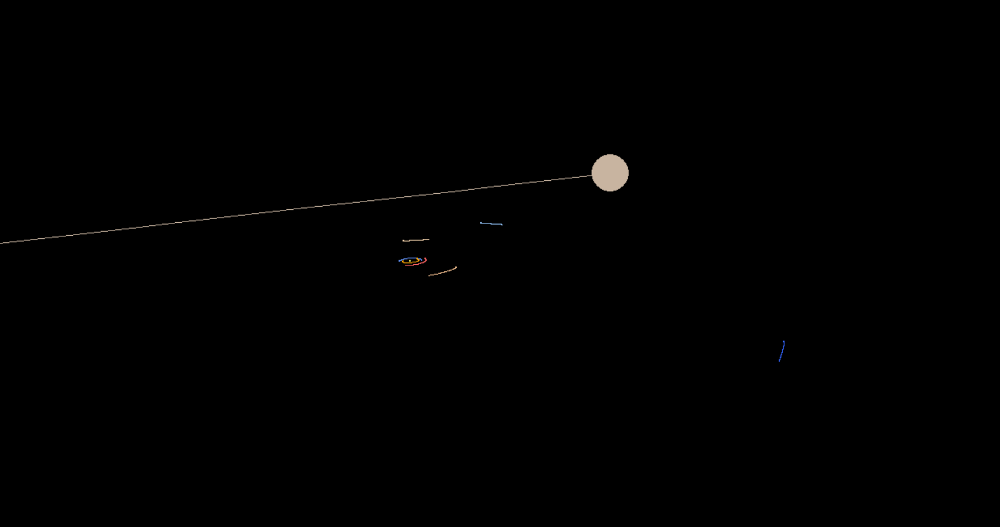
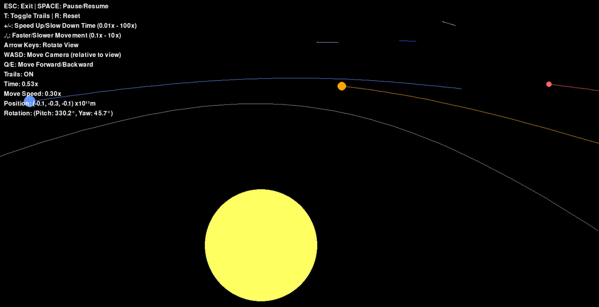
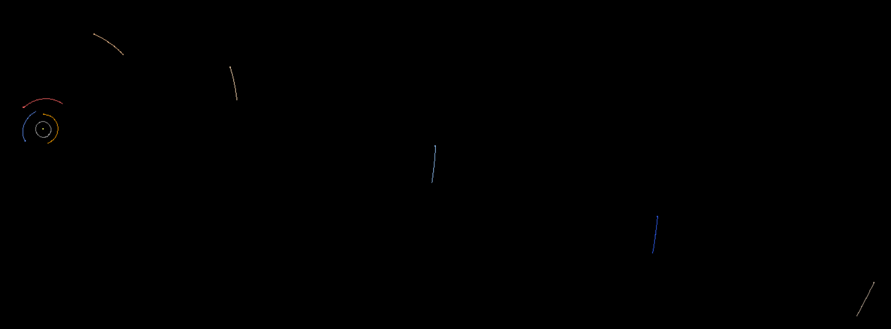
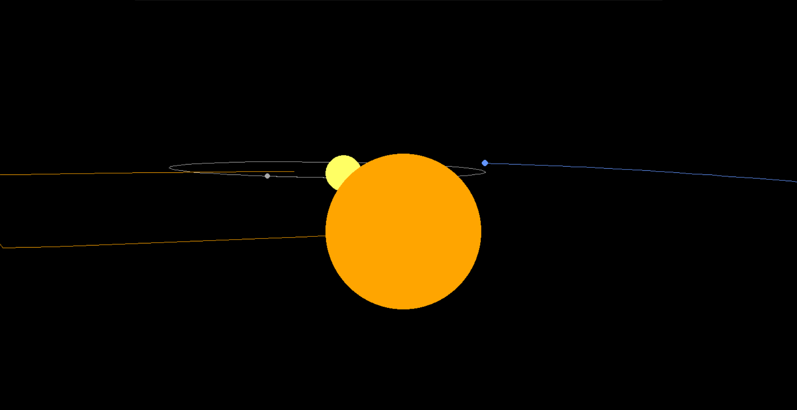
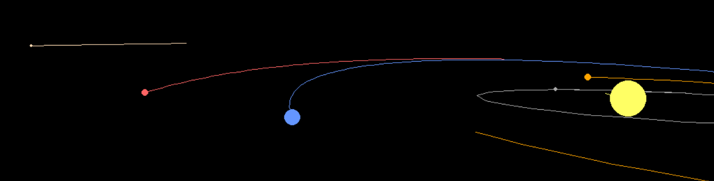

# 3D Gravity Simulation



A realistic 3D solar system simulation with accurate gravitational physics, orbital mechanics, and free camera movement.

## Features

### **Realistic Solar System**

- **Complete planetary system** with all 8 planets + Pluto
- **Accurate orbital inclinations** - Mercury (7.0°), Venus (3.4°), Earth (0°), Mars (1.9°), Jupiter (1.3°), Saturn (2.5°), Uranus (0.8°), Neptune (1.8°), Pluto (17.2°)
- **Real astronomical data** - Actual masses, distances, and orbital velocities
- **Proper scale representation** - Bodies sized for visibility while maintaining proportions


*Can you find the missing planet?*

### **Advanced Physics Engine**

- **N-body gravitational simulation** - All bodies interact gravitationally
- **Accurate constants** - Real gravitational constant and time steps
- **Orbital mechanics** - Planets follow realistic elliptical orbits
- **Time manipulation** - Speed up or slow down simulation (0.01x to 100x)

### **Professional 3D Camera**

- **5DOF movement** - Move in any direction (X,Y,Z) + rotate (yaw/pitch)
- **Proper perspective projection** - Realistic 3D to 2D screen projection
- **Depth-based rendering** - Proper occlusion of distant objects
- **Adjustable movement speed** - Control camera speed independently (0.1x to 10x)
- **Intuitive controls** - Global yaw + local pitch rotation

### **Visual Features**

- **Smooth orbital trails** - Distance-based trail generation with intermediate points
- **Time-independent trails** - Consistent trail length regardless of simulation speed
- **Gap-free rendering** - Trails connect smoothly to current positions
- **Depth-sorted rendering** - Proper 3D layering
- **Color-coded planets** - Realistic planetary colors

## Controls

### **Time Controls**

- **`+` / `=`** - Speed up time (max 100x)
- **`-`** - Slow down time (min 0.01x)
- **`SPACE`** - Pause/Resume simulation
- **`R`** - Reset simulation to initial state

### **Camera Controls**

- **`Arrow Keys`** - Rotate camera view (pitch/yaw)
- **`WASD`** - Move camera relative to view direction
- **`Q/E`** - Move forward/backward along camera view
- **`.` / `,`** - Adjust camera movement speed (0.1x to 10x)
- **`ESC`** - Exit simulation

### **Display Controls**

- **`T`** - Toggle orbital trails on/off
- **`C`** - Toggle UI instructions on/off
- **UI shows** - Current time multiplier, movement speed, camera position, rotation



## Visuals

### **Visual Expectations**



The simulation displays a beautiful, scientifically accurate representation of our solar system with:

- **Dominant yellow Sun** at the center with realistic gravitational influence
- **Inner planets** (Mercury, Venus, Earth, Mars) with moderate orbital speeds
- **Gas giants** (Jupiter, Saturn) with impressive size and slower orbits
- **Ice giants** (Uranus, Neptune) with distinctive blue-green coloring
- **Highly inclined Pluto** orbiting above/below the main planetary plane
- **Smooth orbital trails** showing the paths each planet takes through space

### **3D Perspective Effects**



- **Distance-based sizing** - Objects appear smaller when farther away
- **Proper occlusion** - Distant objects correctly hidden behind nearer ones
- **Realistic depth** - Full 3D spatial relationships maintained
- **Smooth camera movement** - Navigate freely through 3D space

### **Orbital Mechanics**



- **Elliptical orbits** - Planets follow Kepler's laws naturally
- **Gravitational interactions** - All bodies affect each other realistically
- **Conservation laws** - Energy and momentum properly conserved
- **Time dilation** - Speed up to see years pass in seconds

## Getting Started

### **Prerequisites**

- Python 3.8+ recommended
- NumPy for mathematical operations
- Pygame for graphics and input

### **Installation**

```bash
# Clone the repository
git clone <repository-url>

# Navigate to project
cd 3d-gravity

# Install dependencies
pip install -r requirements.txt

# Run the simulation
python main.py
```

### **Quick Start**

1. Run `python main.py` from project root
2. Use `ESC` to exit anytime
3. Press `C` to toggle UI for clean viewing
4. Experiment with time controls (`+/-`) to see orbital evolution
5. Navigate with `WASD + Q/E + Arrow keys` to explore the solar system
6. Resize window dynamically while maintaining centered view

## Technical Details

### **Physics Constants**

- **Gravitational constant**: G = 6.67430e-11 m³/kg·s²
- **Time step**: DT = 86400 seconds (1 day)
- **Distance scale**: 1e9 meters for astronomical distances
- **Frame rate**: 60 FPS for smooth animation

### **Orbital Parameters**

- **Mercury**: 5.79e10 m orbital radius, 47.87 km/s orbital velocity
- **Venus**: 1.082e11 m orbital radius, 35.02 km/s orbital velocity  
- **Earth**: 1.496e11 m orbital radius, 29.78 km/s orbital velocity
- **Mars**: 2.279e11 m orbital radius, 24.07 km/s orbital velocity
- **Jupiter**: 7.785e11 m orbital radius, 13.07 km/s orbital velocity
- **Saturn**: 1.434e12 m orbital radius, 9.68 km/s orbital velocity
- **Uranus**: 2.873e12 m orbital radius, 6.80 km/s orbital velocity
- **Neptune**: 4.495e12 m orbital radius, 5.43 km/s orbital velocity
- **Pluto**: 5.906e12 m orbital radius, 4.74 km/s orbital velocity

### **Camera System**

- **Projection**: Perspective projection with field-of-view scaling
- **Movement**: 5 degrees of freedom (3 translation + 2 rotation)
- **Rotation**: Global yaw (Y-axis) + local pitch (right vector)
- **Depth calculation**: Dot product-based camera space transformation
